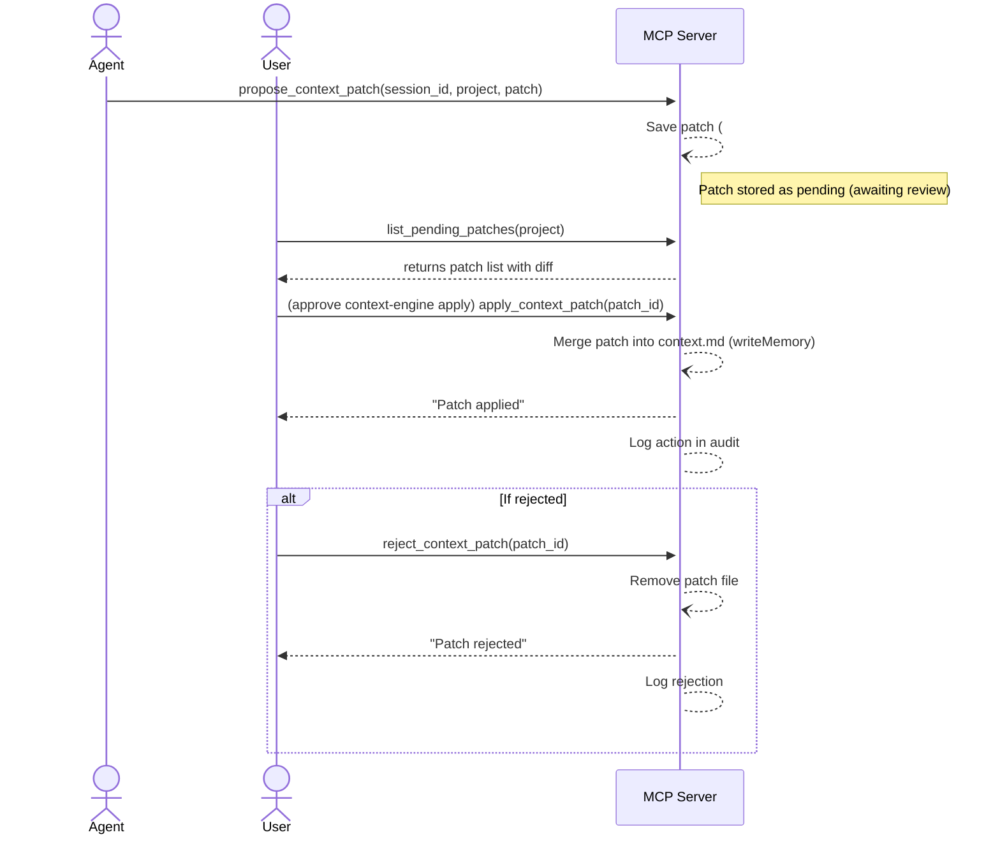

# ContextEngine MCP: Development & Research Plan

## Executive Summary

ContextEngine MCP is now implemented as a **local-first memory layer** that synchronizes user context (`context.md`) with multiple AI agents via MCP tools. The repository extends `agent-loop-mcp` into a broader system with a **master context file structure** (`context.md`, `topics/`, `sessions/`, `pending-patches/`, `sources/`), a full context tool surface (`propose_context_patch`, `read_context`, `apply_context_patch`, etc.), and a **trust model** based on audit logs, diff review, patch approval, and undo. 

Success now means developers can easily **capture projects in `context.md`** and have any AI agent read or write context with explicit review, while we validate adoption in real workflows. The implementation is in place; the remaining plan focus is external verification, PMF testing, and release hardening. This document still covers the architecture, trust model, sync strategy, developer UX, testing/CI, migration, prioritized roadmap, PMF experiments, monetization/distribution strategy, and documentation/onboarding. 

Key recommendations (which we will justify and detail below): 

- **Architectural separation:** Keep both **agent loops (session memory)** and **project context memory**. Use `agent-loop-mcp` code for short-term agent state, but add a **master `context.md`** for long-lived user context, plus directories for topics, patches, etc.  
- **New MCP tools:** Implement tools for reading/searching context, appending captures, proposing and applying context patches, reviewing pending patches, logging agent outcomes, and compacting topics. These tools will follow MCP JSON schemas and return diffs or content.  
- **Trust & provenance:** Show source metadata, require user approval of agent-proposed patches (`diff review` UI/CLI), and maintain an **audit log**. Start with manual `approve/ reject` workflows before any auto-writeback.  
- **Mobile integration:** The mobile ContextEngine app will use local APIs or file sync to push captures (audio transcripts, manual notes) into `context.md` or `sources/`. We'll support offline-first operation and conflict resolution via git-like merge or manual review.  
- **Developer UX:** Provide a simple Node CLI via `npx @yourorg/mcp-contextengine`. Offer example MCP skill code for Claude/ChatGPT/Cursor that calls the new tools. Provide JSON payload examples and scripts for common flows (init context, propose patch, apply patch).  
- **Testing and CI:** Write unit tests for the memory layer (lockfile, parsing), integration tests simulating agent/tool calls (using an MCP client). Use GitHub Actions for CI, with a sample local dev environment (`node`, MCP client stub).  
- **Migration:** Plan how existing `~/.agent-loop-mcp` sessions are handled. Possibly read old sessions as topics in the new system or migrate them into `topics/`. Keep backward compatibility for `init_loop` if needed.  
- **Roadmap:** Break into phases (e.g. Context file model, core tools, patch workflow, agent integration, mobile sync). Each milestone has an estimated effort (Low/Med/High) and risk (e.g. concurrency, UX).  
- **PMF experiments:** Recruit 10–20 AI developers, give them ContextEngine MCP for a week, and measure usage of context tools. Also test with Obsidian/Markdown users. AB test landing-page messaging. Metrics include usage frequency, retained users, and “would be disappointed” scores.  
- **Monetization:** Likely open-source MCP core, possibly a Pro tier (advanced features like git sync, multi-project support, UI) or Cloud offering. Distribute via npm (`@contextengine/mcp`), list in MCP registries (MCP Marketplaces, SkillFM), and community (agent dev forums).  
- **Documentation:** Update README with installation, quick-start CLI commands, and example JSON calls. Create a `SKILL.md` for agents. Provide an onboarding checklist: install `npx`, configure `mcp.json`, run sample script.

The outcome will be a concrete spec and plan to turn `agent-loop-mcp` into a context-layer that “**keeps humans and AI agents in sync**”, moving beyond one-way voice notes to a bidirectional, reviewable memory system.

## Current Implementation Status (2026-06-27)

The repository now includes:

- A full context memory layer with `context.md`, `topics/`, `sources/`, `pending-patches/`, and `sessions/`.
- All planned context tools: init, read, append, search, log, compact, propose, list, reject, apply, and undo.
- Legacy `agent-loop-mcp` compatibility: `init_loop`, `log_step`, `compact_memory`, `report_blocker`, `resume_loop`, and `get_tool_suggestions`.
- Both MCP resources: `contextengine://{project}/context` and `loop://{session_id}`.
- Audit logging, diff-based patch proposal and apply flow, migration from `~/.agent-loop-mcp`, and optional git or Google Drive sync.
- Repo-level assets: README, `server.json`, skill file, CI workflow, package metadata, and publish dry-run support.

Verified locally:

- `npm run lint`
- `npm run smoke:mcp`
- `npm run smoke:protocol`
- `npm run smoke:package`
- `npm run test:integration`
- `npm test` with full unit and integration coverage
- `npm run build`
- `npm run verify`
- `npm publish --dry-run --access public`
- Git sync against a local bare remote

Still requires manual/live verification:

- Google Drive sync with real credentials via `npm run smoke:gdrive`
- Interactive MCP-host spot checks in specific target clients beyond the automated SDK/raw/package stdio coverage. MCP Inspector CLI validation has passed; Claude-family validation is blocked by local Claude Code account balance, and Cursor validation is blocked by Cursor Agent authentication.
- PMF/user-validation experiments described later in this plan

Publish scope:

- **Beta release candidate:** acceptable after local validation, CI, package dry-run, and the MCP host validation matrix pass, provided release notes clearly label Google Drive, mobile sync, and PMF learnings as still being validated. Current status: local validation, CI, package smoke, and MCP Inspector are green; Claude-family and Cursor host checks are waiting on account/auth access.
- **Full public release:** acceptable only after the beta gates plus live Google Drive validation, soak/load hardening, PMF evidence, and mobile field validation are complete.

## 1. Goals and Success Metrics

**Goals:** 
- **Context-central memory:** Store project/idea context in a local Markdown file (`context.md`) with an explicit structure.  
- **Agent interoperability:** Allow any AI agent (Claude, ChatGPT, Cursor, etc.) to read from and write *to* the shared context via MCP.  
- **Reviewable writeback:** No blind memory writes. Agents propose patches (diffs) to the context, and users approve or reject them.  
- **Developer-focus:** Make the tools and setup natural for engineers/AI-builders (e.g. via `npx`, CLI, agent skills).  

**Success Metrics (for prototype evaluation):**  
- *Engagement:* X% of target users (developers/AI-builders) use context tools ≥Y times per week.  
- *Retention:* ≥40% say they’d be “very disappointed” if the tool disappeared (standard PMF indicator).  
- *Task efficiency:* Users report X% reduction in manual re-briefing time (qualitative feedback).  
- *Usage of new tools:* ≥30% of agent sessions involve `propose_context_patch` or `log_agent_outcome`.  
- *Review flow usage:* ≥25% of proposed patches are reviewed (approved/rejected) rather than ignored.  
- *Content growth:* The `context.md` file grows with useful, relevant content (user edits, agent info) after 1–2 weeks of use.  

We will refine these metrics during beta testing with developer participants (see Section 10).

## 2. Architectural Changes

We merge the **agent-loop memory server** with a new **ContextEngine memory layer**. The key architecture is two-tiered storage on the local machine:

- **Master Context (`context.md`):** A single Markdown file containing user/project memory, structured by topics (section headings) and with frontmatter metadata. This is the “second brain” of the user’s current project or role.  
- **Session Memory (`sessions/`):** Per-agent-session state, similar to the existing loop memory (for continuous tasks). Each agent session gets its own `.md`.  
- **Topics directory (`topics/`):** Optional: sub-files or folders for topic-specific context snippets (e.g. individual tasks, ideas) that can be referenced.  
- **Pending Patches (`pending-patches/`):** Folder storing agent-proposed updates (diffs or JSON patch files) awaiting user approval.  
- **Sources (`sources/`):** Raw capture files (transcripts, notes) that fed into context. Maintains provenance.

These directories can live under a config folder, e.g.: 
```
~/.contextengine/
  context.md
  topics/
  sessions/
  pending-patches/
  sources/
```
(Files under `~/.contextengine` could be mirrored to a user-specified project folder if needed.)

<div markdown="1">
```mermaid
flowchart TB
  subgraph Mobile ContextEngine App
    U[Mobile Capture] -->|sync/share| C(context.md & topics/)
  end
  subgraph ContextEngine MCP Server
    C --> S[Server: Memory Layer (files & schema)]
  end
  subgraph AI Agent Workspace
    A[AI Agent (Claude/Cursor/etc)] -->|MCP calls| S
    S -- reads/writes --> M(context.md, sessions)
  end
  U --> S
  A --> S
```
*Figure: Architecture – Mobile app captures context, stored in `context.md`; the MCP server reads/writes this context for AI agents.*  
</div>

Key **architectural tasks**:

- **Config directory:** Use a directory like `~/.contextengine/` (or allow custom path) instead of `~/.agent-loop-mcp`. Ensure it is created if absent.  
- **Context file format:** Define `context.md` with YAML frontmatter (agent state metadata) plus markdown sections. Example structure:
  ```
  ---
  project: "MyProject"
  updated: 2026-06-26T...
  ---
  # Topic: Project Goals
  - [x] Feature A
  - [ ] Feature B
  # Topic: Decisions
  ...etc...
  ```
- **File locks:** Continue using `proper-lockfile` or similar to prevent corruption on concurrent access.  
- **Extend existing code:** Start with `agent-loop-mcp` code (which already handles `.md` with frontmatter via `gray-matter`). Refactor so the same memory read/write logic can operate on `context.md` (master) vs session files.  

From the `agent-loop-mcp` plan (Section 3 of [20]), we keep its approach of a Markdown+YAML format. We will add extra sections for topics. This aligns with Memori’s insight that memory should use structured representations rather than raw transcripts.

## 3. New MCP Tools

We will **add** several MCP tools (methods) to manage ContextEngine. Each tool has a name, description, and JSON input schema. Below is a summary (see table). These complement (or in some cases replace) the existing `init_loop`, `log_step`, etc.

| Tool name              | Purpose                                               | Input schema (example JSON) |
|------------------------|-------------------------------------------------------|-----------------------------|
| **init_context**       | Initialize a new project context or session. Creates `context.md` (or session file) with title. | `{ "session_id": "string", "project": "string" }` |
| **read_context**       | Read the *master* context file. Returns full text (markdown). | `{ "project": "string" }` |
| **search_context_topics** | Search topics or keywords in context. Returns matching sections or excerpts. | `{ "project": "string", "query": "string" }` |
| **append_capture**     | Append a user-provided note or capture to a specific topic in `context.md`. | `{ "project": "string", "topic": "string", "text": "string" }` |
| **propose_context_patch** | Agent proposes changes to `context.md`. Stores patch (diff) under pending. | `{ "session_id":"string","project":"string","patch":"string" }` |
| **list_pending_patches**  | List all pending patch proposals (IDs, authors, summary). | `{ "project": "string" }` |
| **reject_context_patch**  | Reject a pending patch (mark as discarded). | `{ "patch_id": "string" }` |
| **apply_context_patch**   | Apply a previously approved patch: merge into `context.md`. | `{ "patch_id": "string" }` |
| **log_agent_outcome**     | Log an agent’s task result in a topic. E.g. record that an agent completed a step. | `{ "session_id": "string", "topic": "string", "outcome": "string" }` |
| **compact_topic**        | Summarize a long topic/section: archive older content into summary (reduces size). | `{ "project":"string", "topic":"string", "summary":"string" }` |

Each tool’s JSON schema will follow the MCP toolkit style. For example, **`propose_context_patch`** could have schema:
```json
{
  "type": "object",
  "properties": {
    "session_id": {"type": "string"},
    "project": {"type": "string"},
    "patch": {"type": "string", "description": "Unified diff or Markdown fragment to insert"}
  },
  "required": ["session_id","project","patch"]
}
```
And an example call (via MCP `CallTool`) might be:  
```json
{ 
  "tool": "propose_context_patch",
  "arguments": {
    "session_id": "sess-123", 
    "project": "ContextEngine", 
    "patch": "## New Topic: Research Notes\n- Agent found an edge case and updated docs."
  }
}
```
The server would store this in `pending-patches/` (e.g. as a JSON or diff file) and return a message like “Patch #7 created (awaiting approval).”  

Similarly, **`apply_context_patch`** will take the `patch_id` and merge its changes into `context.md` (after user review) and remove it from pending. **`list_pending_patches`** returns metadata of outstanding patches (author agent, date, short diff excerpt).  

We will implement these in the MCP server (`src/index.ts`), following the patterns in `agent-loop-mcp`. For example, adding to the `ListTools` handler:
```ts
{ 
  name: "propose_context_patch", 
  description: "Propose updates to context.md (for user review).", 
  inputSchema: { /* as above */ }
},
{ 
  name: "list_pending_patches", 
  description: "List all pending context patch proposals.", 
  inputSchema: { type:"object", properties:{project:{type:"string"}}, required:["project"] }
},
...
```
And in the `CallTool` handler, code to implement each. For `propose_context_patch`, use a helper in memory.ts that creates a diff file under `pending-patches/` with a unique ID, e.g. incrementing or UUID. You can leverage `proper-lockfile` to ensure no race conditions.

Below is a **sample list** of tool definitions (we will refine in code):

| Tool (JSON name)          | Description                                                         |
|---------------------------|---------------------------------------------------------------------|
| `init_context`            | Creates `context.md` for a new project/session. Initializes metadata (project name, timestamps). |
| `read_context`            | Returns full markdown of `context.md` (or a section) as an MCP resource. |
| `search_context_topics`   | Searches text in `context.md` (full-text). Useful for agents to find relevant info. |
| `append_capture`         | Adds a note (from user/app) under a topic. E.g. appending a voice-transcribed idea. |
| `propose_context_patch`   | Agent proposes a set of changes (diff) to `context.md`. |
| `list_pending_patches`    | Lists unreviewed proposals (ID, summary, timestamp, agent). |
| `reject_context_patch`    | Discards a pending patch. |
| `apply_context_patch`     | Merges an approved patch into `context.md` (performs atomic write). |
| `log_agent_outcome`       | Logs an agent’s result or decision under a topic in `context.md`. |
| `compact_topic`           | Moves old topic details into a summary (reducing context length). |

Each of these will have a precise input schema (using Zod or JSON Schema) and meaningful text output. We will include example JSON in the README and docs. (See **Section 11** below for an example JSON call snippet.)

## 4. Data Model & File Layout

We will use a **file-based data model** under a dedicated directory (e.g. `~/.contextengine/`). The core files and directories:

| Path                       | Description                                                         |
|----------------------------|---------------------------------------------------------------------|
| `~/.contextengine/context.md`      | **Master context file**. Contains YAML frontmatter (project/session metadata) and Markdown sections (topics). This is the single source of truth for user context. |
| `~/.contextengine/topics/`   | Optional: Individual files per topic or category, e.g. `topic-devnotes.md`. Agents/users can write to these. Topics may correspond to headings in `context.md`. |
| `~/.contextengine/sessions/` | **Agent sessions**. Each agent run (e.g. a Claude or Cursor session) gets a file like `sess-{id}.md`, similar to old `agent-loop` memory. Used for the agent’s short-term loop state. |
| `~/.contextengine/pending-patches/` | **Pending proposals**. Each agent-proposed patch saved as a separate file or entry (e.g. JSON or diff). Holds patches awaiting user review. |
| `~/.contextengine/sources/`  | **Raw sources**. e.g. transcripts, voice note dumps, or external data snapshots. This folder preserves provenance of captures that fed into context. |

**Context file example:**  
```yaml
---
project: "ContextEngine"
session_id: "proj-001"
created: 2026-06-25T10:00:00Z
---
# Project Goals
- Build a personal AI context layer.
- Target developer/AI power users.

# Meeting Notes
We had a demo call on 2026-06-20. Key points:
- Need two-way sync with AI agents.
- Mobile voice capture is nice-to-have.

# Decisions
- Focus initial MVP on developer workflows.
```

- The YAML frontmatter (parsed by `gray-matter`) stores metadata like `session_id`, `status`, `last_updated` (see `AgentStateSchema` in [memory.ts](https://raw.githubusercontent.com/meharajM/agent-loop-mcp/main/src/memory.ts) for an example).  
- Topics (headings) structure the content. Agents can refer to a specific heading to append or read that section.  
- The `context.md` is versioned (with atomic write), so we can include it under Git if desired for manual history, and easily diff changes.

**Pending patch format:** Could be a JSON or Markdown diff file, e.g.:
```json
{
  "id": "patch-7",
  "session_id": "sess-123",
  "project": "ContextEngine",
  "patch_text": "- Fixed typo in Goals section\n+ Added outcome under Decisions",
  "timestamp": "2026-06-26T12:34:00Z"
}
```
These are stored under `pending-patches/patch-7.json`.  

**File locking:** We will use `proper-lockfile` (already in agent-loop-mcp) to lock `context.md` and other files during writes, preventing corruption if multiple agents or user actions happen concurrently.

## 5. Security, Provenance, and Trust Model

A core principle is **no blind writes** to the user’s memory. We will adopt a **review-and-approve model**:

- **Patch Review Flow:** When an agent calls `propose_context_patch`, the server writes the proposed change to `pending-patches/` and returns a patch ID. The user (via UI or CLI) then calls `list_pending_patches` to see outstanding proposals (with diffs). They inspect the diff and then call either `apply_context_patch(patch_id)` or `reject_context_patch(patch_id)`.  
- **Audit logs:** We will maintain an append-only log (could be in frontmatter or a separate file) of all applied patches, their origin (agent name, timestamp), and rejections. This helps track provenance: who changed what and when.  
- **Diff-based UI/CLI:** Provide a command or script that shows a `git diff` style output for each patch before approval. E.g.:  
  ```bash
  npx context-engine list-patches --project "ContextEngine"
  ```
  This could print:
  ```
  Patch 7 by AgentX at 2026-06-26T12:34:
  diff --git a/context.md b/context.md
  @@ -1,5 +1,6 @@
   # Project Goals
   - Build a personal AI context layer.
  +- Integrate offline voice capture next sprint.
   - Target developer/AI power users.
  ```
- **User confirmation:** Only on explicit approval do we modify `context.md`. If user never approves, the patch stays pending or can be expired.  
- **Permissions:** By default, the MCP server runs under the user’s account and honors file permissions. We assume a single-user setup (no multi-user collab initially). In future, one could add password-protection for applying patches or cryptographic signing. For now, the trust boundary is: if an agent is connected, its proposals must be manually accepted by the user.  
- **Undo/Versioning:** Since we use atomic writes, the previous version of `context.md` can be preserved (e.g. `context.md.bak`) or simply retrieved via Git/VCS. We can implement an “undo” tool if needed that reverts the last patch (like `git revert`).  

These measures address the known risk of **memory poisoning**. Research shows that agents writing malicious or incorrect data to memory can cause serious issues unless provenance is tracked. By requiring an explicit patch review, we ensure no untrusted content is blindly injected. (Cf. guidelines from the survey of memory poisoning attacks: agent memory is often untrusted, so a trusted review step is critical.) In the future, we could add **content filtering** (e.g. scanning for disallowed commands) as an extra guard, but human review is the core.

## 6. Integration with Mobile ContextEngine

The mobile ContextEngine app (iOS/Android) is the front-end for capturing voice/text notes into `context.md`. For a coherent system:

- **APIs/Sync:** The simplest approach is to treat the mobile app and MCP server as two interfaces to the same files. For example, sync the `~/.contextengine/context.md` with the mobile device via iCloud/Dropbox/Firebase. Alternatively, the mobile app could call the MCP server’s APIs directly (running on a local machine or microservice). For MVP, file sync is easier: ensure `context.md` is stored in a cloud-synced folder.  
- **Offline-first:** The app should queue captures when offline and merge later. We must handle **conflicts**: if the user edits context on mobile while an agent applied a patch on desktop, merging may produce duplicates. We can use a simple conflict resolution strategy (like Git) or prompt the user to manually resolve “context conflicts.” The roadmap should include testing sync conflicts.  
- **Sources folder:** When mobile captures a voice note, it can optionally upload the raw audio or transcription to `sources/` (e.g. `sources/note1.txt`). This creates provenance. The agent server could offer a `ReadResource` for these if needed.  
- **Data flow:** For example, a user speaks an idea; the mobile app transcribes and appends it via `append_capture(project, topic, text)` (or directly edits `context.md`). When the user later runs an agent (e.g. in Claude), that agent can call `read_context` or use MCP to load the updated `context.md`. After the agent runs, it may propose patches.  

To summarize, **mobile integration** is primarily about syncing the `context.md` file bi-directionally. We will:
- Document where to place `context.md` so that mobile can access it.
- Possibly create an HTTP endpoint in MCP server (optional) so the app could push new captures.  
- Ensure the mobile capture features (voice, shortcuts) target this `context.md` in the correct format (e.g. adding under correct topic heading). 

## 7. Developer UX (CLI, npx, Agent Skills)

We want ContextEngine MCP to feel native to developers:

- **Distribution:** Publish the server as an npm package, e.g. `@contextengine/mcp-server`. Users install via `npx @contextengine/mcp-server`. This matches the existing `agent-loop-mcp` style (`npx @mhrj/mcp-agent-loop`). We will also create a `@contextengine/context-skill` NPM package (or Yarn) for the agent skill instructions.  
- **npx Setup:** In README, instruct developers:  
  1. `npm install -g @modelcontextprotocol/cli` (or use any MCP client).  
  2. `npx @contextengine/mcp-server --port  PORT` to start the server.  
  3. Update `mcp_config.json` in their home or project with:  
     ```json
     {
       "mcpServers": {
         "context-engine": {
           "command": "npx",
           "args": ["@contextengine/mcp-server", "--root", "~/.contextengine"]
         }
       }
     }
     ```  
  4. (Optional) `npx skills add @contextengine/context-skill --yes` to import assistant instructions.  

- **CLI Tools:** Provide a CLI shim (like a small Node binary) to run actions. For example:
  ```bash
  npx context-engine create --project "MyProject"     # runs init_context
  npx context-engine list                           # list projects/sessions
  npx context-engine propose --session sess1 --patch-file update.diff
  npx context-engine list-patches --project MyProject
  npx context-engine review --patch 7
  npx context-engine apply --patch 7
  ```
  These commands internally call the MCP tools. We will bundle a small CLI (e.g. with yargs) for convenience. This is **optional** but can improve adoption.  

- **Agent Skill Code Examples:** We will include sample code for popular agent frameworks. For example, for **Claude Code** or **Cursor**, the skill might look like (pseudocode):
  ```yaml
  - name: ContextEngine-Init
    instructions: |
      Initialize project context by calling `init_context`.
      Use the session_id and project name given by user or system.
  - name: ContextEngine-Propose
    instructions: |
      After completing a subtask, propose updates to the context with `propose_context_patch`.
      Ensure to attach the objective, current step, and any results as a patch.
  ```
  Or in a Javascript skill snippet:
  ```js
  const { callTool } = context.protocol;
  // Initialize loop
  await callTool("init_loop", {session_id: sess, objective: "My goal..."});
  // ... agent loop ...
  // Propose patch
  await callTool("propose_context_patch", {
    session_id: sess,
    project: "MyProject",
    patch: "Added summary of last analysis..."
  });
  ```
  The README will show one or two of these workflows.  

- **JSON Payload Examples:** In docs we will include examples, for instance:
  ```json
  // Example: Append capture from mobile/CLI
  { "tool": "append_capture", "arguments": {"project":"MyProject", "topic":"Ideas", "text":"Called Alice about the bug."} }
  
  // Example: Agent proposes a patch
  { "tool": "propose_context_patch", "arguments": {
       "session_id":"dev-session-001",
       "project":"MyProject",
       "patch":"# Task Update\n- Agent fixed the login flow bug."
     }
  }
  ```
  And show expected output text.

In short, **simplicity is key**: the setup should look like any other MCP tool. We will emphasize this in developer docs and README.

## 8. Testing, CI/CD, and Development Environment

A robust testing pipeline is essential:

- **Unit tests (low-level):**  
  - Test the memory read/write: parse a sample markdown (with frontmatter and content) and ensure `readMemory`/`writeMemory` round-trips correctly.  
  - Test session and context file locking: Simulate concurrent writes (possibly with `fs` and locks) to verify no corruption.  
  - Test Zod validation: invalid frontmatter should throw errors.  
- **Integration tests (tools):**  
  - Using an MCP test client (or writing scripts), simulate calling each tool in sequence on a fresh context. For example:  
    1. Call `init_context`. Assert a new `context.md` exists.  
    2. Call `append_capture` and verify the content appears.  
    3. Call `propose_context_patch`, then `list_pending_patches`, then `apply_context_patch`, and check the patch is merged.  
  - Test blocked scenarios: e.g. calling `apply_context_patch` with no pending should error.  
- **E2E tests:**  
  - Write a dummy agent script that uses the MCP SDK to emulate an agent workflow (like the existing `test_loop.sh` does for agent-loop). For example, a Node or Python script that:  
    * Initializes a session,  
    * Logs a few steps,  
    * Proposes a context update,  
    * Resumes loop,  
    * Calls compact,  
    * Applies patch.  
  - Verify at each step that `context.md` and the session files contain expected text.  
- **Local dev environment:**  
  - Use Node.js (v18+). Provide `npm run dev` script to start the server (maybe with `ts-node-dev`).  
  - Possibly use Docker for reproducible environment (MCP server is Node-based, so not strictly needed, but can ensure environment consistency).  
  - Include a `docker-compose.yml` example that runs the MCP server and a simple client (for demonstration/CI).  

- **CI/CD:**  
  - GitHub Actions pipeline: run tests on push/PR. Lint code (ESLint/Prettier), run unit tests (Jest or Mocha), check type errors (TypeScript).  
  - Optional: publish to npm on tag/release.  

- **Versioning & Releases:** Use semantic versioning. Tag releases (e.g. v1.0.0). Include CHANGELOG for breaking changes.

The existing `agent-loop-mcp` has a `test_loop.sh`; we will create similar test scripts for the new tools.

## 9. Migration / Backward Compatibility

For users migrating from `agent-loop-mcp` or earlier prototypes:

- **Session memory:** The old data is in `~/.agent-loop-mcp/*.md`. We can support reading those if `contextengine` is aware of the old path. Possibly, on first run, import any `~/.agent-loop-mcp/*.md` into `~/.contextengine/sessions/` (rename directory). We might automatically read from both locations. A migration script could detect old files and copy them.  
- **Context as session:** If a user has started using `context.md` manually, ensure the server does not overwrite it. The `init_context` tool should check if `context.md` exists and either refuse or load it.  
- **Configuration:** Allow users to set a custom root (like `--root` flag) if they want to place the context in a project directory instead of home. The code in memory.ts uses `os.homedir()`, but we should support `process.env.CONTEXT_ENGINE_ROOT` or a CLI argument.  

In practice, because the focus is new, we can warn: “Existing session memory (agent-loop) is not automatically merged into context. You can still use `init_loop` to access old sessions if you configure the MCP server with the legacy path.” That said, any data in old sessions is usually just intermediate logs, so migrating it is lower priority.

## 10. Prioritized Roadmap

| Milestone | Status | Effort | Risk | Description |
|-----------|:------:|:------:|:----:|-------------|
| **Context File Model & Storage** | Done | Low | Low | `context.md`, namespaced project storage, `topics/`, `sources/`, `pending-patches/`, and session storage are implemented. |
| **Core context tools** | Done | Med | Low | `init_context`, `read_context`, `append_capture`, `search_context_topics`, `log_agent_outcome`, and `compact_topic` are implemented and tested. |
| **Patch workflow** | Done | High | Med-High | Proposal, listing, rejection, apply, expiry cleanup, audit logging, and undo are implemented and covered by integration tests. |
| **Legacy compatibility** | Done | Med | Med | Migration from `~/.agent-loop-mcp` and all 6 legacy tools/resources are implemented. |
| **Documentation & packaging** | Done | Med | Low | README, skill file, `server.json`, package metadata, and publish dry-run support are present. |
| **Testing & CI** | Done | Med | Low | Unit/integration tests and GitHub Actions CI are implemented. |
| **Git sync** | Done | Med | Med | Automated git sync is implemented and verified against a local bare remote. |
| **Cross-client MCP validation** | Implemented | Med | Med | Highest release priority. SDK-based stdio, raw JSON-RPC stdio, built-binary smoke, and packed-artifact smoke now cover protocol/runtime compatibility; host-specific UI spot checks still remain. |
| **Google Drive sync** | Implemented | Med | Med | Second release priority. Create/update behavior is covered by automated tests, and `npm run smoke:gdrive` provides a live credentialed smoke path when a real folder is available. |
| **Performance & load testing** | Partial | Med | Low | Third release priority. Concurrency safety and larger-context workflows are automated, but longer-running soak and scale tests still remain. |
| **Community feedback / PMF** | Remaining | Ongoing | --- | Fourth release priority. Recruit target users, observe real usage, and tune workflows and messaging. |
| **Mobile sync guidance / product integration** | Remaining | Low | Med | Fifth release priority. The sync strategy exists; product-specific mobile onboarding and conflict-resolution UX still need field validation. |

The roadmap is now mostly a **validation and hardening roadmap** rather than a build roadmap. The highest remaining uncertainty is no longer basic implementation; it is external behavior under real clients, real credentials, and real user workflows.

## 11. Experiment Plan (PMF Validation)

To ensure we are solving a real problem for devs and agents, we propose these validation experiments:

| Experiment           | Participants             | Setup / Tasks                                                                                          | Success Metric                                 |
|----------------------|--------------------------|--------------------------------------------------------------------------------------------------------|-----------------------------------------------|
| **AI Agent Workflow Test** | 10–15 AI-savvy developers (active on GitHub, use Claude/ChatGPT/AI agents regularly) | Provide the ContextEngine MCP tool and instructions. Ask them to integrate it into a coding or research task: *“Use it as your project memory. Every time you complete a subtask with an AI agent, propose a patch to update context.”* Collect usage logs. | - ≥40% say they’d be “very disappointed” if the tool vanished.<br>- ≥50% propose ≥3 patches per week.<br>- ≥30% use `read_context`/`search_context_topics` at least 5 times (indicating they rely on context). |
| **Obsidian/Markdown User Test** | 5–10 PKM users (familiar with Obsidian/markdown, local vault users) | Give them the voice/text capture app connected to ContextEngine MCP. Task: “Use voice or quick notes to capture ideas into your Markdown vault for 7 days. Occasionally run an agent (Claude or GPT) on your vault and let it update it.” | - ≥10 voice/text captures per user.<br>- ≥60% of captures end up categorized/edited (showing they value structure).<br>- ≥50% apply at least one agent-suggested context update. |
| **Messaging A/B Test** | Online (developer forums, newsletters) | Create 3 landing pages with different taglines: 1) “AI voice notes for your second brain.” 2) “Private `context.md` for all your AI agents.” 3) “Never re-explain your project to AI again.” Measure click-throughs and signups for an early adopter waitlist. | Determine which headline gets highest CTR and signups among audience (expect #2 or #3 to appeal more to devs than generic “voice notes”). |

**Metrics:** We will use surveys (post-experiment) to ask users how much value they gained. Tools like Hotjar or simple Google Forms can capture “would you be disappointed?” (Curtis-Yu measure). Usage logs (with user consent) will track actual tool calls. The goal is to see meaningful adoption in a realistic setting, not just toy usage. 

## 12. Monetization & Distribution Strategies

- **Open Source Core:** The MCP server and agent skill will be open-source (e.g. MIT license). This encourages adoption and trust (developers can audit code). We will publish on GitHub and npm (e.g. `@contextengine/mcp-server`).  
- **Free vs Paid Tiers:** While the base memory sync is free (everyone wants local capture), advanced features could be gated. For example: 
  - *Free:* Basic capture, `context.md` editing, limited agent writebacks (maybe daily limit).
  - *Pro:* Unlimited agent patches, custom AI insights (e.g. auto-summary templates), multi-project support. Price ~$5–$10/mo (similar to developer tools pricing).
  - *Enterprise:* Team sync (multi-user workspaces), cloud sync/integration (e.g. with corporate databases), compliance features. Price negotiable.
- **MCP Marketplaces:** Register the MCP server in directories (like claudemarketplaces.com [4]) so Claude Code users can easily discover “ContextEngine MCP”. This acts like an app store for agents. Also list in the **ModelContextProtocol** registry (https://modelcontextprotocol.io) and SkillFM.  
- **Community Engagement:** Promote on AI/Agent forums (e.g. Anthropic community, AI developer Discords), and possibly partnerships (Obsidian plugin? GitHub integration?).  
- **Documentation & Examples:** Make it easy to try: “npx context-engine” as a one-liner demo. Provide sandbox code for free usage, then upsell power features.  

Since many target users value privacy, charging for a local/private tool could be challenging (developers often expect open tools). One idea is to monetize related services (like cloud sync add-on, or context analytics). But initially, focus on adoption.

## 13. Documentation & Onboarding

The **README** on GitHub will include:

- **Installation:** How to install MCP client and the server. (Example commands above.)  
- **Configuration:** Example `mcp_config.json` snippet, environment variables (`CONTEXT_ENGINE_ROOT`).  
- **Quick Start:** A simple example walkthrough: initialize a project, append a note, simulate an agent proposing a patch, approve it. Use clear commands and expected output.  
- **Tool Reference:** A table of MCP tools with names, input descriptions, and example JSON (mirroring our table above).  
- **Mobile Setup:** Guide for mobile: where to save `context.md`, how to enable share-to-app.  
- **FAQ:** Common pitfalls (e.g. “I get a lock error – you can try `git pull`” or “my mobile edits not showing up, try manually syncing”).  
- **Examples:** Possibly host a small demo repository with scripts.  
- **Contributing:** Encourage pull requests, issues (especially for new agent support).  

We will also provide a **SKILL.md** (Anthropic skill or OpenAI plugin description) summarizing how an LLM agent should use these tools (similar to `skills/agentic-loop/SKILL.md` in the original repo). This can be included in the `agentic-loop-mcp` fork or as `contextengine-skill`. 

**Onboarding Checklist (in README):**  
1. Clone/fork the repo or npm install.  
2. `npm install` and `npm run build`.  
3. `mcp client` tool installed globally.  
4. Update `~/.contextengine` (or run `init_context`).  
5. Try a demo: `npx context-engine init --project "TestProj"`. Check that `context.md` appears.  
6. Use the CLI or agent skill to append content and propose a patch.  
7. Review and apply the patch, and see `context.md` updated.  

We will also include CLI help (`--help`) and richly-commented example config in the repository.

## 14. Diagrams

Below is a **workflow diagram** for context patch proposals and approval:



This shows the **two-way flow**: agents *propose*, users *approve/reject*.  

*(Citations: The need for such a trustworthy review stems from recent research on memory security.)*

## 15. Actionable Next Steps

1. **Run live MCP inspector/client validation:** This is the highest-priority release gate. Exercise every tool and both resources from target MCP hosts and the inspector, beyond the automated SDK/raw/package stdio coverage.
2. **Run a real Google Drive sync smoke test:** This is next because the repo still advertises optional Drive sync. Use `npm run smoke:gdrive` with a credentialed folder to validate upload/update behavior, error messaging, and path assumptions.
3. **Expand load testing beyond current regressions:** This is the final technical validation priority before broader field rollout. Stress-test multi-thousand-line `context.md` files, repeated patch proposals, and longer-running concurrent workflows.
4. **Recruit early users for PMF validation:** After technical release gates are green, run the experiment plan below to measure actual context-tool usage, review flow usage, and retention.
5. **Validate mobile field guidance and refine product guidance:** Use the mobile cohort to answer sync/conflict questions, then adjust README, skill instructions, onboarding, and sync guidance based on real friction points.
6. **Cut the first beta release after local and host gates are green:** Tag and publish a beta only if unvalidated workflows are labeled accordingly.
7. **Cut the full public release after the first five items are green:** Announce a broad release only after the technical and field-validation priorities above are complete.

The build work is largely complete. The next steps are now about proving the implementation in real environments and refining the product around actual usage.

### Release Priority Order

For release readiness, the remaining work should be tackled in this order:

1. **Cross-client MCP host validation**
2. **Google Drive live validation**
3. **Soak/load hardening**
4. **PMF field validation**
5. **Mobile field validation**
6. **Release cutover**

## 16. Parallel Execution Tracks

The remaining work can now be executed in parallel with minimal merge risk by keeping ownership separated by file class and outcome:

| Track | Goal | Ownership boundary | Output | Depends on |
|-------|------|--------------------|--------|------------|
| **Track A: Soak & scale hardening** | Extend validation beyond current concurrency and large-context coverage | `src/__tests__/soak.test.ts`, optional `scripts/soak-smoke.ts` | CI-friendly soak/load regression | None |
| **Track B: External validation runbooks** | Make host/client and Google Drive live validation executable by any operator | `docs/host-validation.md`, `docs/gdrive-live-validation.md` | Host matrix, Drive runbook, evidence checklist | Existing smoke scripts |
| **Track C: PMF and field operations** | Convert product/PMF/release uncertainty into operational checklists | `docs/pmf-validation.md`, `docs/mobile-sync-guidance.md`, `docs/release-gate.md` | Cohort plan, mobile guidance, release gate | Existing roadmap + validation outputs |

Recommended execution order inside the parallel wave:

1. Start all three tracks immediately.
2. Merge Track A first because it can expand the automated validation contract.
3. Merge Track B next so live-host and Drive checks follow a stable runbook.
4. Merge Track C after the validation surfaces are defined, since its release gate should reference the latest checks.

Recommended follow-up wave after this one:

1. Execute the host/client matrix from Track B in at least two real targets.
2. Execute the live Google Drive smoke with real credentials.
3. Feed those results into the release gate from Track C.

---

**Sources:** We followed the agent-loop-mcp design (with modifications), and aligned with MCP/agent best practices. Research (Memori) recommends structured memory layers over raw transcripts, and recent security studies emphasize careful review of agent-written memory. These informed our plan for a portable, bidirectional context system for AI agents.
